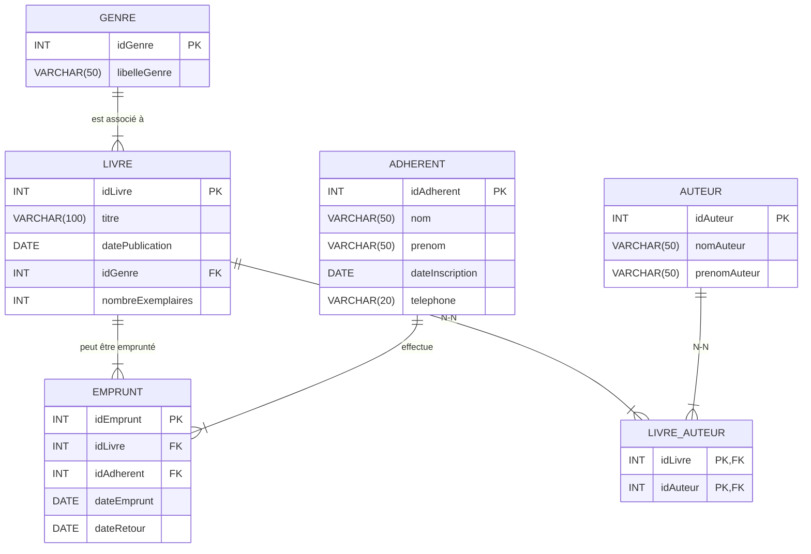

# TD 8 SQL - Audit et evolution d'une base de données
[]()

## Correction

### **Partie 1 : Correction / Optimisation de la base**

#### **Analyse de la structure existante**

1. **Table Livre**

    - Le champ `auteur` est répété pour chaque livre, et rien ne garantit l’orthographe ou l’identité exacte d’un auteur.
    - Le champ `genre` est un simple texte, ce qui peut provoquer des incohérences (différentes orthographes pour un même genre).
2. **Table Emprunt**

    - Pas de clé étrangère formelle pour lier `idLivre` à `Livre` et `idAdherent` à `Adherent`.
    - Aucune contrainte n’assure qu’il reste suffisamment d’exemplaires disponibles.
3. **Table Adherent**

    - Structure simplifiée, mais généralement correcte pour les besoins actuels.
4. **Pas d’index** pour accélérer les recherches fréquentes (par titre, par genre, etc.).


#### **Optimisations proposées**

1. **Séparer la notion d’auteur** dans une table distincte :

    - Table `Auteur(auteurID, nomAuteur, prenomAuteur, …)` et un lien via une table d’association (car un livre peut avoir plusieurs auteurs, en particulier si c’est un ouvrage collectif).
2. **Remplacer la colonne `genre` par une table de référence** :

    - Table `Genre(idGenre, libelleGenre)`
    - Clé étrangère dans la table `Livre`.
3. **Créer les clés étrangères** dans la table `Emprunt` :

    - `FOREIGN KEY (idLivre)` REFERENCES `Livre(idLivre)`
    - `FOREIGN KEY (idAdherent)` REFERENCES `Adherent(idAdherent)`
4. **Ajouter des index** sur les champs utilisés fréquemment en recherche :

    - Sur `Livre(titre)` ou `Livre(genre)`
    - Sur `Adherent(nom, prenom)`

#### **Mise en place des modifications**


```sql
-- On recrée proprement la base (optionnel) ou on modifie les tables existantes

-- 1) Table Genre
CREATE TABLE Genre (
    idGenre INT PRIMARY KEY AUTO_INCREMENT,
    libelleGenre VARCHAR(50) NOT NULL
);

-- 2) Table Livre avec clé étrangère sur Genre
CREATE TABLE Livre (
    idLivre INT PRIMARY KEY AUTO_INCREMENT,
    titre VARCHAR(100) NOT NULL,
    datePublication DATE,
    idGenre INT,
    nombreExemplaires INT,
    CONSTRAINT FK_Livre_Genre FOREIGN KEY (idGenre)
        REFERENCES Genre(idGenre)
);

-- 3) Table Adherent (inchangée sauf si besoin de modifications)
CREATE TABLE Adherent (
    idAdherent INT PRIMARY KEY AUTO_INCREMENT,
    nom VARCHAR(50),
    prenom VARCHAR(50),
    dateInscription DATE,
    telephone VARCHAR(20)
);

-- 4) Table Auteur (si on veut un fichier d'auteurs propre)
CREATE TABLE Auteur (
    idAuteur INT PRIMARY KEY AUTO_INCREMENT,
    nomAuteur VARCHAR(255) NOT NULL,
);

-- 5) Table Livre_Auteur (table d’association pour la relation N-N entre Livre et Auteur)
CREATE TABLE Livre_Auteur (
    idLivre INT,
    idAuteur INT,
    PRIMARY KEY (idLivre, idAuteur),
    CONSTRAINT FK_LivreAuteur_Livre FOREIGN KEY (idLivre) REFERENCES Livre(idLivre),
    CONSTRAINT FK_LivreAuteur_Auteur FOREIGN KEY (idAuteur) REFERENCES Auteur(idAuteur)
);

-- 6) Table Emprunt (avec FK vers Livre et Adherent)
CREATE TABLE Emprunt (
    idEmprunt INT PRIMARY KEY AUTO_INCREMENT,
    idLivre INT,
    idAdherent INT,
    dateEmprunt DATE,
    dateRetour DATE NULL,
    CONSTRAINT FK_Emprunt_Livre FOREIGN KEY (idLivre) REFERENCES Livre(idLivre),
    CONSTRAINT FK_Emprunt_Adherent FOREIGN KEY (idAdherent) REFERENCES Adherent(idAdherent)
);


```

---

### **Partie 2 : Implémentation de nouvelles logiques**

#### **1. Gestion des quotas d’emprunt**

> **Règle :** Un adhérent ne peut pas emprunter plus de 3 livres en même temps.

##### **Proposition A : Vérification côté application**

La méthode la plus simple (mais moins automatisée) consiste à vérifier cette règle dans l’application (côté code) avant d’insérer un nouvel emprunt.

##### **Proposition B : Contrainte via un Trigger**

On peut mettre en place un _trigger_ (sur SQL Server, MySQL ou autre SGBD qui supporte les triggers) qui s’active avant l’insertion d’un nouvel emprunt. Ce trigger :

1. Compte le nombre d’emprunts actifs (dateRetour IS NULL) de l’adhérent.
2. Empêche l’insertion si le nombre d’emprunts actifs >= 3.

```sql
CREATE TRIGGER trg_LimitEmprunt
BEFORE INSERT ON Emprunt
FOR EACH ROW
BEGIN
    DECLARE nbEmpruntsActifs INT;

    SELECT COUNT(*) INTO nbEmpruntsActifs
    FROM Emprunt
    WHERE idAdherent = NEW.idAdherent
      AND dateRetour IS NULL;

    IF nbEmpruntsActifs >= 3 THEN
        SIGNAL SQLSTATE '45000'
            SET MESSAGE_TEXT = 'Quota maximum d’emprunt (3) déjà atteint pour cet adhérent';
    END IF;
END;

```

Avec ce trigger, la **nouvelle insertion** sera bloquée si l’adhérent a déjà 3 emprunts en cours.

---

#### **2. Gestion des retards**

> **Règle :** Si un adhérent dépasse les 15 jours d’emprunt, un incident de retard doit être enregistré.

Pour mettre en place cette règle, nous devons :

1. **Créer une table** pour stocker les incidents :

```sql
CREATE TABLE IncidentRetard (
    idIncident INT PRIMARY KEY,
    idEmprunt INT,
    dateIncident DATE NOT NULL,
    commentaire VARCHAR(255),
    CONSTRAINT FK_Incident_Emprunt FOREIGN KEY (idEmprunt) REFERENCES Emprunt(idEmprunt)
);

```
2. **Définir la logique** de détection de retard. Plusieurs approches :

    - **Approche A :** Un _trigger_ `AFTER UPDATE` sur la table `Emprunt` qui vérifie la `dateRetour`. S’il s’avère que la `dateRetour` est > `dateEmprunt + 15 jours`, on insère un incident.
    - **Approche B :** Un script ou procédure planifiée (tâche cron, job SQL, etc.) qui vérifie chaque jour les emprunts en cours et crée un incident dès qu’on dépasse les 15 jours.

##### **Exemple de Trigger (approche simplifiée)**

```sql
CREATE TRIGGER trg_Retard
AFTER UPDATE ON Emprunt
FOR EACH ROW
BEGIN
    -- Vérifie que le livre vient d'être rendu ( OLD.dateRetour IS NULL, NEW.dateRetour IS NOT NULL )
    -- et compare la date de retour à la date d'emprunt + 15 jours.
    IF OLD.dateRetour IS NULL 
       AND NEW.dateRetour IS NOT NULL
       AND NEW.dateRetour > DATE_ADD(NEW.dateEmprunt, INTERVAL 15 DAY) THEN

        INSERT INTO IncidentRetard (idIncident, idEmprunt, dateIncident, commentaire)
        VALUES (
            (SELECT IFNULL(MAX(idIncident)+1,1) FROM IncidentRetard),
            NEW.idEmprunt,
            NEW.dateRetour,
            CONCAT('Retard de ', DATEDIFF(NEW.dateRetour, NEW.dateEmprunt) - 15, ' jours')
        );
    END IF;
END;

```
> **Remarque :** Ce code est à adapter selon votre SGBD (MySQL, SQL Server, PostgreSQL, etc.). Les fonctions `DATE_ADD`, `DATEDIFF` et `IFNULL` peuvent varier selon le dialecte SQL.

**Conclusion sur le retard :**

- Dès qu’un emprunt est clôturé (dateRetour renseignée), on vérifie la durée d’emprunt.
- Si > 15 jours, on enregistre un incident dans la table `IncidentRetard`.

---

### **Tests et validations**

1. **Test du quota** :

    - Essayez d’insérer 4 emprunts (dateRetour NULL) pour un même adhérent. La 4ème insertion doit échouer (trigger) ou être bloquée par l’application.
2. **Test du retard** :

    - Insérez un emprunt avec `dateEmprunt = '2023-01-01'`.
    - Mettez à jour sa `dateRetour` à `'2023-01-20'` (> 15 jours après).
    - Vérifiez que la table `IncidentRetard` contient un nouvel incident.

### **Schema de base de données final**

