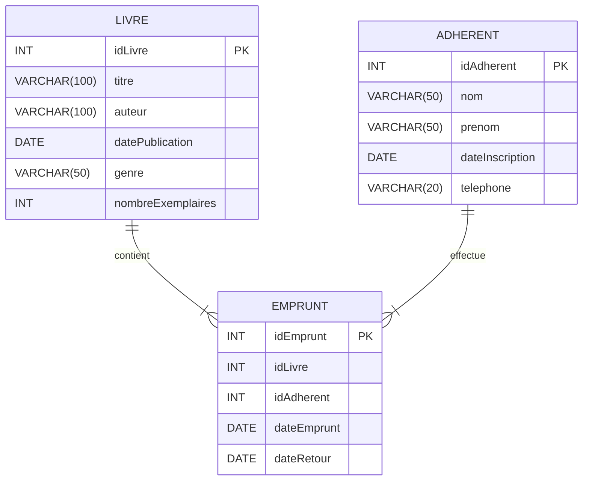

# TD 8 SQL - Audit et evolution d'une base de données

#### **Contexte et objectifs pédagogiques**

Vous êtes amené à créer et à maintenir la base de données d’une médiathèque. Au fil du temps, de nouvelles exigences apparaissent, nécessitant à la fois des optimisations de la structure initiale et la mise en place de nouvelles logiques métier.

Votre travail s’articulera en trois grandes parties :

1. **Implémentation d’une base simple** (avec une structure volontairement non optimale).
2. **Correction / optimisation de la base** en proposant les améliorations structurelles adéquates.
3. **Implémentation de nouvelles logiques** nécessitant une modification de la structure de la base.

L’objectif est de comprendre et d’appliquer les principes de conception d’une base de données relationnelle, d’en améliorer la structure au besoin (normalisation, clés étrangères, index, etc.) et d’implémenter de nouvelles fonctionnalités métier.

---

### **Description de la base de données**

La base de données de la médiathèque est composée de trois tables principales :

---

### **Partie 1 : Correction / Optimisation de la base**

À ce stade, la base fonctionne mais **n’est pas optimisée**. On vous demande de :

1. **Analyser la structure existante** et de lister **les points perfectibles** (ex. : redondances, absence de liens formels entre tables, etc.).
2. **Appliquer ou proposer des optimisations** :
    - Normalisation (par ex. mise en place d’une table `Auteur` si nécessaire, séparation d’entités, etc.).
    - Mise en place de **clés étrangères** et des contraintes d’intégrité associées.
    - Création d’**index** pour améliorer la performance des requêtes fréquentes.
3. **Adapter la base** : modifiez, ajoutez ou supprimez les champs ou tables nécessaires à l’optimisation (par ex. transformer la colonne `auteur` en clé étrangère pointant vers une table `Auteur`).

Vous documenterez chaque changement en **expliquant** pourquoi il est utile.

---

### **Partie 2 : Implémentation de nouvelles logiques**

Suite à des retours d’utilisateurs et à des évolutions de la politique de prêt, de **nouvelles règles** doivent être mises en place :

1. **Gestion des quotas d’emprunt :**  
   Un adhérent ne peut pas emprunter plus de 3 livres en même temps.

2. **Gestion des retards :**  
   À chaque fois qu’un adhérent dépasse les 15 jours d’emprunt, on souhaite enregistrer un « incident de retard » associé à l’adhérent et au livre concerné.

Pour prendre en compte ces règles, il est nécessaire de :

1. **Ajouter / modifier des tables** afin de stocker les informations de quotas et d’incidents de retard (création éventuelle d’une table `Retard` ou `Incident`).
2. **Mettre en place des contraintes et/ou des triggers** pour faire respecter automatiquement les règles de quota ou calculer la date limite d’emprunt.
3. **Écrire les scripts SQL** permettant d’implémenter ces nouvelles logiques (ajout de champs, de tables, de triggers, etc.).

Enfin, réalisez les **tests** nécessaires pour vérifier que :

- Un adhérent ne peut pas avoir plus de 3 emprunts actifs (l’insertion d’un 4ème emprunt doit échouer ou être empêchée).
- Un incident de retard est bien créé en cas de dépassement des 15 jours d’emprunt.